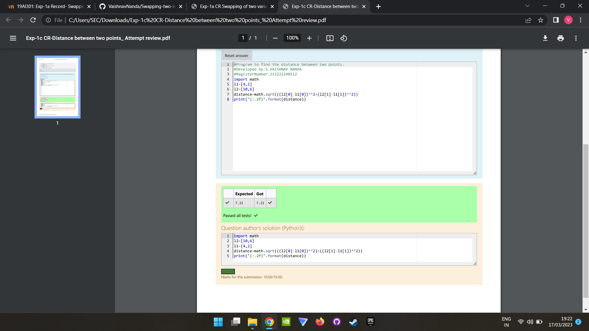

# DISTANCE-BETWEEN-TWO-POINTS

## AIM:
To write a python program to find the distance two 2 points
## ALGORITHM:
### Step 1: 
Get the values from the user
### Step 2: 
Assign values in a variable
### Step 3: 
Get the value from the user for the number of rotation

Substitute the values in the distance formula 

### Step 4: 
Using the slicing concept rotate the list
### Step 5:
By using concatenation operator ,it will join the two values
### Step 6:
print the output

### PROGRAM:
```
import math
l1=[4,2]
l2=[10,6]
distance=math.sqrt(((l2[0]-l1[0])**2+(l2[1]-l1[1])**2))
print("{:.2f}".format(distance))
```

### OUTPUT:



### RESULT:
Circulate the n variables using function is successfully executed.

