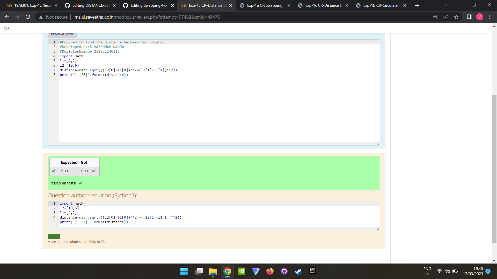

# DISTANCE-BETWEEN-TWO-POINTS

## AIM:
To write a python program to find the distance two 2 points
## ALGORITHM:
### Step 1: 
From the problem write the points in x axis separately
### Step 2: 
From the problem write the points in y axis separately
### Step 3: 
Substitute the values in the distance formula 

### Step 4: 
By using square function in math module we can take square root
### Step 5:
print the output

### PROGRAM:
```
#Program to circulate N values.
#Developed by:S Vaishnav Nanda 
#RegisterNumber:212222240112
import math
l1=[4,2]
l2=[10,6]
distance=math.sqrt(((l2[0]-l1[0])**2+(l2[1]-l1[1])**2))
print("{:.2f}".format(distance))
```

### OUTPUT:



### RESULT:
Thus the distance between two points is executed successfully.

